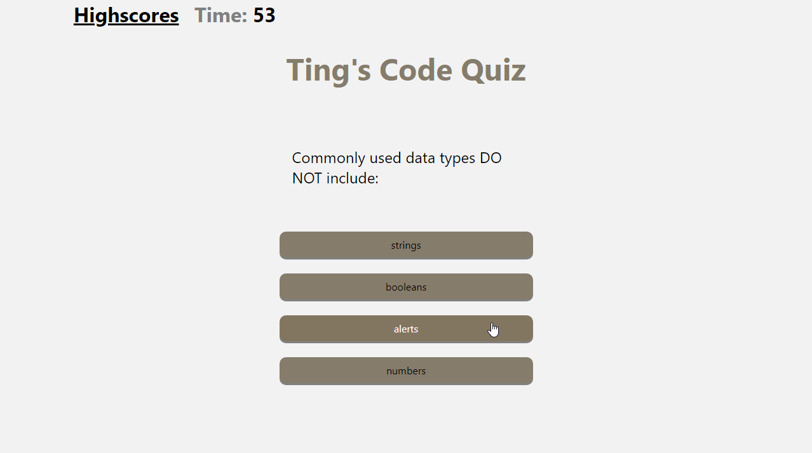

# Week-4-Challenge-Code-Quiz

## Description
This week's challenge was to create a timed quiz that gives you a final score at the end which can be saved onto a scoreboard with your initials. One main issue with this assignment I did not manage to figure out was the sorting of the scoreboard from highest to lowest.

## Screenshot

##  Link to completed challenge
https://tiiingaling.github.io/Week-3-Challenge-Password-Generator/
